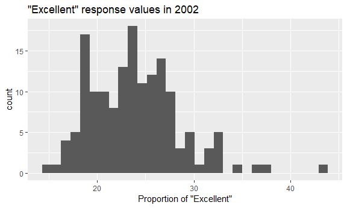
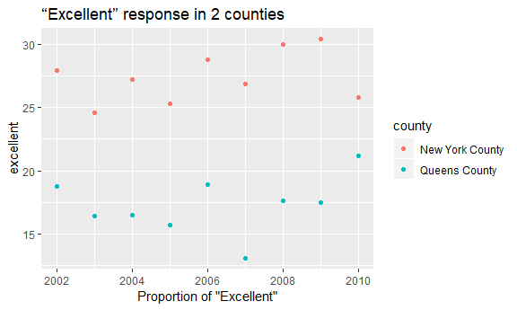

p8105\_hw2\_bg2604
================
Boya Guo
10/5/2018

``` r
library(tidyverse)
```

    ## -- Attaching packages -------------------------------------------------- tidyverse 1.2.1 --

    ## √ ggplot2 3.0.0     √ purrr   0.2.5
    ## √ tibble  1.4.2     √ dplyr   0.7.6
    ## √ tidyr   0.8.1     √ stringr 1.3.1
    ## √ readr   1.1.1     √ forcats 0.3.0

    ## -- Conflicts ----------------------------------------------------- tidyverse_conflicts() --
    ## x dplyr::filter() masks stats::filter()
    ## x dplyr::lag()    masks stats::lag()

``` r
library(readxl)
library(knitr)
```

``` r
knitr::opts_chunk$set((echo = TRUE),
  fig.width = 6,
  fig.asp = .6,
  out.width = "90%"
)
```

Problem 1 NYC Transit
---------------------

1.1 Import NYC transit csv file usirng relative path, and clean the dataset.

``` r
transit_data = read_csv(file="./data/NYC_Transit_Subway_Entrance_And_Exit_Data.csv")%>%
  janitor::clean_names() %>% 
  gather(key = route_number, value=route_name,route1:route11)%>%
  separate(route_number, into = c("route", "route_number"), sep = 5) %>%
  filter(!is.na(route_name))%>%
  select(line, station_name, station_latitude, station_longitude, route_number,route_name, entry, vending, entrance_type, ada)%>%
  mutate(entry=ifelse(entry=='YES',yes=TRUE,no=FALSE))%>%
  arrange(line,station_name)
```

    ## Parsed with column specification:
    ## cols(
    ##   .default = col_character(),
    ##   `Station Latitude` = col_double(),
    ##   `Station Longitude` = col_double(),
    ##   Route8 = col_integer(),
    ##   Route9 = col_integer(),
    ##   Route10 = col_integer(),
    ##   Route11 = col_integer(),
    ##   ADA = col_logical(),
    ##   `Free Crossover` = col_logical(),
    ##   `Entrance Latitude` = col_double(),
    ##   `Entrance Longitude` = col_double()
    ## )

    ## See spec(...) for full column specifications.

The NYC transit dataset contains: Division, line, station names, station and entrance locations, routes in each station, differnet trains for each route in station, whether the station allows entrance or vending, entrance type, staffs, free crossover, North South and East West streets and corners,and ADA compliance.

Cleaning steps:

With the understanding of dataset, I noticed that the routes is speard across 11 columns. I used the "gather" function to transpose. Then, I used "seperate" function to split the "route\_number" column into "route" and "route\_number". After that, I used "filter" function to only detect observations with non-missing "route\_name". I used "select" function to retain the variables I need, and converted the "entry"" variable from character to a logical variable. For the last step, I arranged the dataset by "line"" and "station\_name".

The dimension of this dataset is 4270 by 10 dataset.

These data are tidy.

1.2 Distinct stations, stations are ADA compliant, and porportion of station entrances/exits without vending entrance

``` r
distinct_station = nrow(distinct(transit_data,station_name,line,.keep_all = TRUE))
distinct_station 
```

    ## [1] 465

``` r
ada_compliance = transit_data %>% 
  filter(ada == TRUE) %>% 
  distinct(station_name,line)
nrow(ada_compliance)
```

    ## [1] 84

``` r
allow_entrance = transit_data %>% 
  filter(entry==TRUE & vending == 'NO') %>% 
  distinct(line,station_name)

vending = transit_data %>% 
  filter(vending == 'NO') %>% 
  distinct(line,station_name)
proportion = nrow(allow_entrance)/nrow(vending)
proportion
```

    ## [1] 0.4343434

There are 465 distinct stations, 84 are ADA compliant, and 43% of station entrances/exists without vending allow entrance.

1.3 Distinct stations serve the A train? Of the stations that serve the A train, how many are ADA compliant?

``` r
a_train = transit_data %>% 
  filter(route_name=='A') %>% 
  distinct(station_name,line)
nrow(a_train)
```

    ## [1] 60

``` r
a_ada = transit_data %>% 
  filter(route_name=='A' & ada==TRUE) %>% 
  distinct(station_name,line)
nrow(a_ada)
```

    ## [1] 17

There are 60 distinct stations serve the A train; of the stations that serve the A train, 17 are ADA compliant.

Problem 2 Mr Trash Wheel
------------------------

Read and clean dataset

``` r
trash = read_excel(path = './data/HealthyHarborWaterWheelTotals2018-7-28.xlsx',sheet = 'Mr. Trash Wheel',range = cell_cols("A:N"))%>%
  janitor::clean_names()%>%
  filter(!is.na(date))%>%
  mutate(sports_balls=as.integer(signif(sports_balls)))
```

Read and clean precipitation data for 2016 and 2017

``` r
pre_2016 = read_excel(path = './data/HealthyHarborWaterWheelTotals2018-7-28.xlsx',sheet = '2016 Precipitation',range = cell_rows(2:14))%>%
  janitor::clean_names()%>%
  mutate(year=2016)

pre_2017 = read_excel(path = './data/HealthyHarborWaterWheelTotals2018-7-28.xlsx',sheet = '2017 Precipitation',range = cell_rows(2:14))%>%
  janitor::clean_names()%>%
  mutate(year=2017)

pre_1617=bind_rows(pre_2016,pre_2017)%>%
  janitor::clean_names()%>%
  select(year, everything())%>%
  mutate(month=month.name[month])
```

Mr.Trash Wheel dataset has 285 observations and the key variable is weight\_tons.

The dataset for year 2016-2017 precipitation has 24 observations and the key variable is total precipitation for each month.

The total precipitation in 2017 is 32.93.

The median number of sports balls in a dumpster in 2016 is 26.

Problem 3 BRFSS
---------------

Format and clean data

``` r
devtools::install_github("p8105/p8105.datasets")
```

    ## Skipping install of 'p8105.datasets' from a github remote, the SHA1 (21f5ad1c) has not changed since last install.
    ##   Use `force = TRUE` to force installation

``` r
library(p8105.datasets)
brfsm=brfss_smart2010 %>% 
  janitor::clean_names() %>%
  separate(locationdesc, into = c("state", "county"), sep = " - ") %>%
  filter(topic=='Overall Health')%>%
  select(-class,-topic,-question,-sample_size,-locationabbr,-(confidence_limit_low:geo_location))%>%
  spread(key = response, value = data_value)%>%
  janitor::clean_names()%>%
  select(year,state,county,excellent,very_good,good,fair,poor)%>%
  mutate(above_good=excellent+very_good)
```

Answer questions

``` r
nrow(distinct(brfsm,state,county))
```

    ## [1] 404

``` r
nrow(distinct(brfsm,state))
```

    ## [1] 51

``` r
count(brfsm,state)%>%
  arrange(-n)%>%
  head(1)
```

    ## # A tibble: 1 x 2
    ##   state     n
    ##   <chr> <int>
    ## 1 NJ      146

``` r
brfsm%>%
  filter(year==2002, !is.na(excellent)) %>% 
  pull(excellent) %>% 
  median()
```

    ## [1] 23.6

``` r
brfsm%>%
  filter(year==2002)%>%
  ggplot(aes(x = excellent))+ 
  geom_histogram()+
  labs(
    title = '"Excellent" response values in 2002',
    x = 'Proportion of "Excellent"'
  )
```

    ## `stat_bin()` using `bins = 30`. Pick better value with `binwidth`.

    ## Warning: Removed 2 rows containing non-finite values (stat_bin).



``` r
brfsm%>%
  filter(county =='New York County' | county == 'Queens County')%>%
  ggplot(aes(x = year, y = excellent))+ 
  geom_point(aes(color = county))+
  labs(
    title = '“Excellent” response in 2 counties',
    x = 'Proportion of "Excellent"'
  )
```



There are 404 unique locations are included in the dataset.

All states are represented; NJ is the state observed the most.

In 2002, the median of the “Excellent” response value is 23.6.
